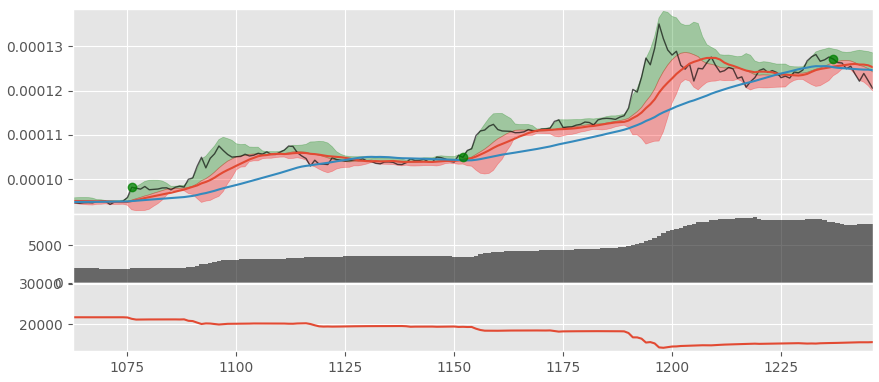

# Crypto AlgoTrading Framework

[](https://app.codacy.com/app/ivopetiz/crypto-algotrading?utm_source=github.com&utm_medium=referral&utm_content=ivopetiz/crypto-algotrading&utm_campaign=Badge_Grade_Dashboard)
[](https://travis-ci.com/ivopetiz/crypto-algotrading)
[](https://coveralls.io/github/ivopetiz/crypto-algotrading?branch=master)

## Algorithmic trading framework for cryptocurrencies in Python

Crypto AlgoTrading Framework is a repository with tools to build and run working trading bots, backtest strategies, assist on trading, define simple stop losses and trailing stop losses, etc. This framework work with data directly from Crypto exchanges API, from a DB or csv files. Can be used for data-driven and event-driven systems. Made exclusively for crypto markets for now and written in Python.

*   [Operating modes](#operating-modes)
*   [How to start](#how-to-start)
*   [Entry functions](#entry-functions)
*   [Exit functions](#exit-functions)
*   [Plot data](#plot-data)
*   [Logs](#logs)
*   [Examples](#examples)
*   [Additional info](#additional-info)

___
## Operating modes

Framework has 3 operating modes:

*   Realtime -- Trades with real data in real time, with real money or in simulation mode.
*   Tick-by-tick -- Testing strategies in real time frames, so user can follow its entries and exits strategies.
*   Backtest -- Backtesting strategies and presenting the results.

### Realtime

In realtime, Trading Bot operates in real time, with live data from exchanges APIs. It doesn't need pre stored data or DB to work.
In this mode, bot can trade real money, simulate or alert user when is time to buy or sell, based on entry and exit strategies defined by user. Can also simulate user's strategies and present the results in real time.

### Tick-by-tick

Tick-by-tick mode allows users to check strategies in a visible timeframe, to better check entries and exit points or to detect strategies faults or new entry and exit points. Uses data from csv files or DB.

### Backtest

Allows users to backtest strategies, with previous stored data. Can also plot trading data showing entry and exit points for implemented strategies.

## How to start

### Pre requisites

In order to get crypto-algotrading fully working is necessary to install some packages and Python libs, as IPython, Pandas, Matplotlib, Numpy, Python-Influxdb and Python-tk. 
On Linux machines these packages could be installed with:

```bash
pip install -r requirements.txt
```

### Collecting data

First step is to collect data. To get markets data is necessary to run a DB, to get and manage all data or save the data to CSV files.
There are 2 options:

*   Install and configure a database.
*   Run a script to collect data and save it to CSV files.

#### Database

Trading Bot is ready to operate with InfluxDB, but can work with other databases, with some small changes.

To install, configure and use a InfluxDB database, you can clone this repository:
[https://github.com/ivopetiz/crypto-database]

#### Script

If you don't want to install and manage any databases and simply want to get data to CSV files you can use the script in this Gist:
[https://gist.github.com/ivopetiz/051eb8dcef769e655254df21a093831a]

*Using a database is the best option, once you can analyse and plot data using DB tools, as Chronograf, and can always extract data to CSV if needed.*

## Entry functions

Entry functions aggregate all strategies to enter in a specific market. Once data fill all the requisites to enter a specific market, an action is taken.
Users can use one or several functions in the same call, in order to fill the requesites and enter market/markets.
Functions should return *True*, if the available data represent an exit point for user. If not the return need to be *False*.
<entry.py> should aggregate all users' entry functions.

### Example

#### cross SMA

Function <cross_smas> will return *True* if first SMA cross the second one. If not will return *False*.

```python
def cross_smas(data, smas=[5, 10]):
    '''
    Checks if it's an entry point based on crossed smas.
    '''
    if data.Last.rolling(smas[0]).mean().iloc[-1] > \
       data.Last.rolling(smas[1]).mean().iloc[-1] and \
       data.Last.rolling(smas[0]).mean().iloc[-2] < \
       data.Last.rolling(smas[1]).mean().iloc[-2]:
        return True

    return False
```

## Exit functions

Exit functions has all functions responsible for exit strategies. When user is in the market and data met an exit criteria, bot will exit market.
Exit functions can be used with other exit functions, to cover more situations, as used in entry functions.
Stop loss and trailing stop loss are also implemented, in order to exit markets in case of unexpected price drop.
Functions should return *True*, if the available data represent an exit point for user. If not the return need to be *False*.
<exit.py> should aggregate all users' exit functions.

### Example

#### cross SMA

Function <cross_smas> will return *True* if first SMA cross the second one. If not will return *False*.

```python
def cross_smas(data, smas=[10, 20]):
    '''
    Checks if it's an exit point based on crossed smas.
    '''
    if data.Last.rolling(smas[0]).mean().iloc[-1] < \
       data.Last.rolling(smas[1]).mean().iloc[-1] and \
       data.Last.rolling(smas[0]).mean().iloc[-2] > \
       data.Last.rolling(smas[1]).mean().iloc[-2]:
        return True

    return False
```

## Plot data

It's possible to plot entry and exit points, among market data, using Matplotlib lib for Python with the option *plot=True* on function call.

## Log

Can log entry and exit points in order to evaluate strategies, presenting P&L for specific markets and total.

## Examples

Here are some examples of how to use this framework.

### Realtime alert for volume increasing

To get an alert when a market doubles its volume:

```python
import cryptoalgotrading

def alert_volume_x2(data):
    if pd.vol.iloc[-1] > pd.vol.iloc[-2]*2:
        return True
    return False

cryptoalgotrading.realtime([], alert_volume_x2, interval='10m')
```

*alert_volume_x2* checks the value of actual market volume and compare it with the last time frame volume value, alerting user when actual market volume is bigger than last time frame volume value multiplied by 2. Can add functions live on IPython for example of add them to entry and exit python files.

### Backtest a strategy on BTC-DGB pair using SMA

To backtest a cross simple moving average strategy in a specific market and plot the entry points:

```python
import cryptoalgotrading
import entry

cryptoalgotrading.backtest(["BTC-XRP"], entry.cross_smas, smas=[15,40], interval='10m', from_file=True, plot=True)
```

Based on market data available for BTC_XRP pair, code above can present an output like this:



Figure has 3 charts. The chart on top presents on top BTC-XRP data from a certain period, with its Bollinguer bands and 3 SMA lines. Green points represent the entry points for the defined strategy. In the middle is a chart representing volume data and at the bottom is represented the number of selling orders among time. All these fields and charts are configurable on *plot* function.

Can also add exit points by adding an exit function or functions to backtest function.
It is possible to enter multiple entry and exit functions to backtest, in order to define different entry and exit positions.

Both functions are available on entry.py and exit.py as example.

In finance.py are some functions which could be useful to implement some strategies.

## Additional Info

API Key is just needed in case of buy/sell operations. For backtest, tick-by-tick and realtime alert implementations API Key can be left empty.

Buy and sell options are commented and should only be used if you know what you are doing.

___

<p align="center">USE THIS AT YOUR OWN RISK.</p>